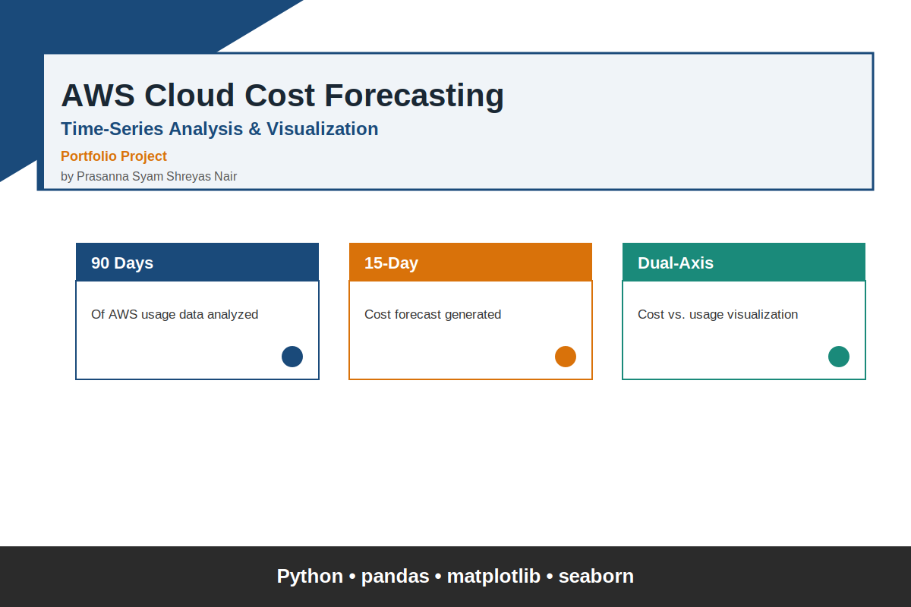
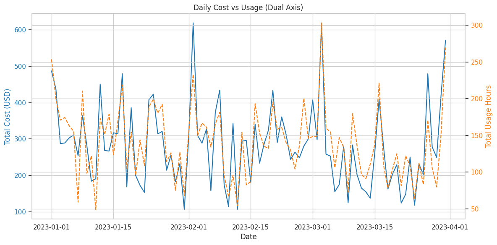
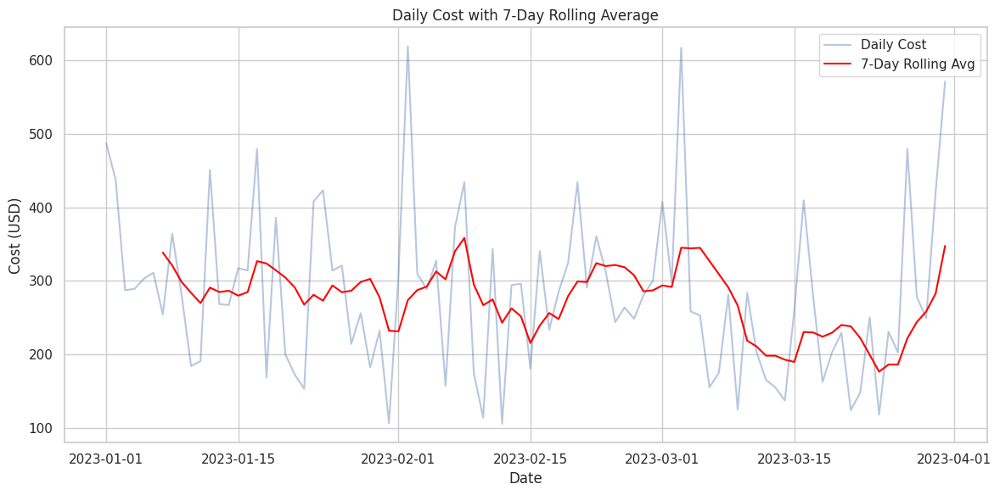
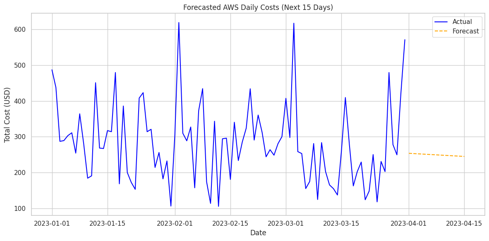

# Forecasting & Visualizing AWS Cloud Costs

A data analysis project exploring AWS usage and cost patterns, combining exploratory analysis, visualization, and simple predictive modeling to understand what drives cloud spend over time.

## What it does
- Grouped summaries of cost by service, region, and date
- Dual-axis visualizations comparing daily cost against usage hours, to see whether usage actually drives cost
- Exploratory analysis to surface spending trends and anomalies
- A 15-day cost forecast based on historical trends

`aws_usage.csv` is bundled so the notebook runs standalone — no external downloads needed.

## Results

Daily cost tracks usage hours fairly closely, with a few notable spikes worth digging into:

A 7-day rolling average smooths out day-to-day noise to reveal the underlying trend:

Projecting forward from historical patterns:

## Tech
Python, pandas, NumPy, matplotlib, seaborn, scikit-learn
